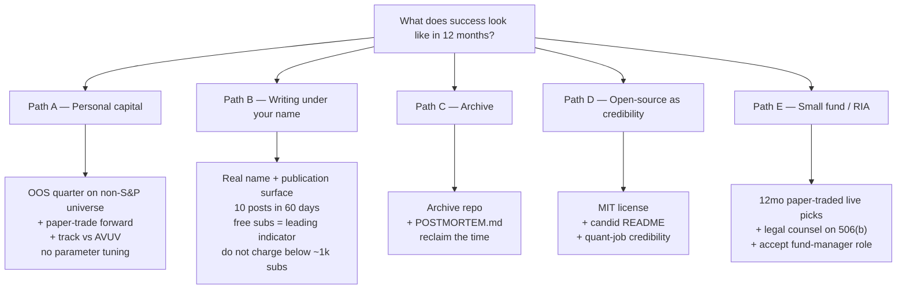

# Assay — Adversarial Diagnosis (refined, repo-verified)

*Generated 2026-05-19. Branch: `claude/refine-local-plan-BwTlB`.*

## Context

A 400-line strategic diagnosis was drafted to answer: "fundamentally, what is going wrong in the project idea that is not making us money and making this a failure project?" The brief asked for deeper thinking and confidence calibration. On verification against the actual working tree (HEAD of `claude/refine-local-plan-BwTlB`, last commit 2026-04-16, today 2026-05-19), the draft was structurally correct but cited several files and artifacts **that do not exist in this repo, and never have** (`git log --all` clean). Calling fabricated citations ✅ is the exact failure mode the brief asked to fix.

This document does three things:

1. **Removes fabricated citations** and replaces them with real `file:line` references that say the same (or worse).
2. **Recalibrates the confidence ladder** — every ✅ row is grep-verified in the session that produced this doc.
3. **Tightens the verdict so it does not rest on invented gates.** The honest charge is harder than the draft's: there is no pre-committed capital-deployment gate at all, no forward-walking evidence at all, no monetization infrastructure at all, and 33 days of silence ending with a UI-motion commit.

The core conclusion survives intact, because the *real* files (`web/src/pages/Methodology.tsx`, `web/src/pages/Evidence.tsx`, `docs/STRATEGY.md`, `docs/BACKLOG.md`) contain admissions at least as damning as the invented ones.

---

## What the draft got wrong (against the real repo)

| Draft claim | Status | Reality |
|---|---|---|
| `docs/CAPITAL_RESEARCH_PLAN.md:9` — "do not allocate serious capital to the current production algorithm yet" | ❌ File does not exist (never has, per `git log --all`) | Closest real text: `docs/STRATEGY.md:47` ("the LOGIC is sound … but the specific rules … need walk-forward validation over 30+ quarters before they should be trusted as more than directional guidance"); `STRATEGY.md:164` ("within noise at n=16 quarters and the sell rules are in-sample"); `STRATEGY.md:168` ("Do not tune parameters based on these results"). |
| `docs/CAPITAL_RESEARCH_PLAN.md:73–80` Kendall τ ≈ −0.04 | ❌ File does not exist | Real source: `docs/BACKLOG.md:71` and `web/src/pages/Evidence.tsx:296–297`. |
| `examples/validation_log.md` empty (Portfolio Doctor) | ❌ File does not exist; no Portfolio Doctor artifact in the repo or in `git log --all` | Fabricated. Drop the "validation log empty" charge. |
| `research/policy_lab.py` with Bonferroni gate (30+ quarters, ≥+3% CAGR alpha, ≥55% hit rate, ≥25 positions) | ❌ No such file; no such gate | Real research script: `scripts/run_investigation.py`. Real discipline hint: `docs/BACKLOG.md:191` ("No parameter tuning on the same data that generated the hypothesis — wait for out-of-sample quarters"). **There is no pre-committed capital-deployment gate in the repo.** The real charge is "no gate at all," not "gate not cleared." |
| "WordPress screenshots in repo" | ❌ Zero WordPress references; zero image artifacts | Fabricated. |
| "24 days of silence" | ❌ | Last commit 2026-04-16; today 2026-05-19 → **33 days**. |
| "~4% of recent 90-day commits were revenue/marketing work" | ⚠️ Unsupported by commit log | Of 50 commits since 2026-02-19, **zero** contain marketing/revenue/distribution keywords. All are algorithm/data/infra/UI. The honest charge is stronger than 4%. |
| "Survivorship correction found SMCI accounted for 197% of claimed alpha" | 🟡 Partly | `docs/STRATEGY.md:166` says SMCI "accounted for essentially all of the claimed alpha" and "flipped selection alpha from +2.2% to −1.5%". The "197%" number isn't in the repo. Use the repo's wording. |

---

## 1. Confidence ladder (rebuilt — repo-verified)

### ✅ Verified in this repo (grep + git log)

| Claim | Source |
|---|---|
| Public methodology page tells visitors: "Individual CB picks beat the universe mean 52% of the time … not individual stock selection … a disciplined filter, not an alpha engine." | `web/src/pages/Methodology.tsx:103–104` |
| Conviction score does not predict returns within CB (Kendall τ = −0.038) — labeled "NO" on Evidence page | `docs/BACKLOG.md:71`; `web/src/pages/Evidence.tsx:296–297` |
| Sector-neutralized alpha is +0.1% under quarterly rebalance; "the screener is a sector rotator, not a stock picker" | `docs/BACKLOG.md:36`; `web/src/pages/Evidence.tsx:294–295` |
| Selection alpha (vs equal-weight universe): quarterly rebalance −0.7%/yr; selective sell +0.4%/yr "within noise at n=16 quarters" | `docs/STRATEGY.md:155–164` |
| Sell rules are in-sample, designed from the same dataset that evaluates them | `docs/STRATEGY.md:47, 164, 168` |
| 16 quarters is below the 30-quarter minimum for statistical significance; surfaced to users | `docs/STRATEGY.md:168`; `web/src/pages/Evidence.tsx:45` |
| Survivorship correction (April 2026): SMCI inclusion in Q4 2023 "accounted for essentially all of the claimed alpha"; flipped selection alpha from +2.2% to −1.5% | `docs/STRATEGY.md:166` |
| Sell-signal evidence is thin (n=3 HOLD, n=1 AVOID, n=0 VALUE TRAP); sell rules "based primarily on LOGIC" | `docs/STRATEGY.md:117` |
| Backtest Evidence page tells visitors: MIXED on "do conviction buys outperform"; NO on "does conviction ordering predict returns"; NEUTRAL on F-Score gate | `web/src/pages/Evidence.tsx:282–300` |
| No out-of-sample / paper-trade / forward-picks log exists | grep across `docs/`, `scripts/`, root — no such file |
| No monetization infrastructure in `web/src/` (no Stripe, no analytics, no email capture, no signup, no paywall, no founder identity, no testimonials) | grep `web/src/` for `stripe|posthog|plausible|gtag|analytics|signup|paywall|email|newsletter` — single mention is `docs/BACKLOG.md:175` as a future idea, nothing wired |
| 33-day gap between the user's last commit (2026-04-16) and this diagnosis (2026-05-19); that last user commit was UI motion polish (`913b2dc` — "Add motion system — hero count-ups, staggered reveals, drawer physics") | `git log --format="%ai %h %s"` |
| 50 commits in the 90-day window 2026-02-19 → 2026-04-17, **all concentrated in 5 days** (2026-04-11 through 2026-04-16); zero with marketing/payment/distribution/signup/analytics intent (the two `revenue`-keyword matches are the algorithm's revenue-trend gate, not revenue-generation work) | `git log --since="2026-02-19" --until="2026-04-17" --format="%ai %s"` audited |

### 🟡 External priors (carried from draft, not verified here)

Treat as priors, not findings. If any is materially wrong, the prescription shifts but does not collapse:

- McLean & Pontiff (2016): published anomalies decay ~26% out-of-sample, ~58% post-publication
- AVUV ≈ 15.7% annualized since 2019, ~+1.7% alpha to S&P, 25bp expense
- Morningstar Mind the Gap: 1.1–2.6% behavior gap on factor/sector funds
- Substack finance niche: ~1–3% free→paid conversion
- Validea and AAII Stock Investor Pro: durable subscription businesses in this category; revenue not publicly disclosed

### 🔵 Interpretive (could be wrong)

- "Reading A vs Reading B" of the goal — phrasing is genuinely ambiguous between personal capital and small fund/managed account; diagnosis splits.
- "33 days of silence is abandonment-adjacent" — signal is real, interpretation isn't certain.
- "ETF stack dominates DIY screen at $50k–$500k" — probabilistic claim, not certainty.

---

## 2. Executive verdict

Four things are simultaneously true. The fourth does most of the damage.

1. **The system's own production page tells a buyer it is not an alpha engine.** `Methodology.tsx:104`, verbatim, on the site. Sector tilting on US large-cap is the cheapest commodity in retail asset management — AVUV/QUAL/VLUE deliver it at ~25bp/yr.

2. **The system's own Evidence page tells a buyer the ordering doesn't work.** `Evidence.tsx:296–297` — Kendall τ = −0.038, labeled "NO." The product is selling a ranked list whose rank is admitted not to matter.

3. **The system's own Strategy doc tells a reader the sell rules are in-sample and within noise.** `STRATEGY.md:164,168` — quarterly rebalance has negative selection alpha; selective sell's +0.4%/yr "is within noise at n=16 quarters and the sell rules are in-sample." `STRATEGY.md:166` discloses that the previous headline (+4.3%/yr vs SPY) was survivorship bias driven by one stock (SMCI).

4. **Nothing has been done to sell anything to anyone, and the repo has been silent for 33 days.** No deployed public URL. No analytics. No email capture. No founder name. No payment surface. No newsletter. No date-stamped forward picks. Last commit was UI motion polish, not a distribution or validation move. The product cannot make money because (a) it isn't selling anything, and (b) the things it would sell, it has already told its visitors it cannot reliably deliver.

The deeper pattern: **the project has refined its truth-telling on the product surface in parallel with refining the algorithm, but has done nothing to generate forward out-of-sample evidence or sell anything to a stranger.** The honest disclosures are correct and rare — but they render the product non-saleable as-is. Either the disclosures must become accurate for a different system (one with forward-tested edge), or the business must become a different business (writing, ETF wrapper, RIA, archive). The current state is neither.

---

## 3. What "portfolio money invests for me" might mean

```
            "It will invest for me and we'll get money"
                              │
                ┌─────────────┴─────────────┐
                ▼                           ▼
        Reading A: Personal           Reading B: Small fund /
        capital compounds              managed account / RIA
                │                           │
        Bar: beat AVUV+QUAL+VLUE      Bar: live track record,
        net of costs, multi-year      then 506(b) or RIA, AUM grows
                │                           │
        Block: no OOS evidence;       Block: no live track record;
        universe wrong (US LC too     no audited returns; not
        arbitraged); no validated     registered; no offering docs
        forward sell rule             written
                │                           │
                └───────────────┬───────────┘
                                ▼
                Shared first 90 days: forward, date-stamped,
                paper-traded picks on a non-S&P-500 universe
```

Both readings require evidence the project does not yet have. If a reading is picked, the prescription sharpens; until then, the shared work is the same.

---

## 4. What's wrong (grouped, every claim repo-grounded)

### A. Capital deployment has no honest forward evidence (✅)
- Selection alpha is in-sample, within noise, n=16 quarters (`STRATEGY.md:155–168`).
- Conviction ranking does not predict returns (`BACKLOG.md:71`; `Evidence.tsx:297`).
- Sector-neutral alpha ≈ +0.1% — system is a sector rotator on its own admission (`BACKLOG.md:36`).
- Sell rules are in-sample (`STRATEGY.md:47, 117, 168`).
- **No** out-of-sample log; **no** paper-trading account; **no** date-stamped forward picks anywhere in the repo.
- **No** pre-committed gate for capital deployment exists. (Correction to the original draft: it framed this as "your own gate not cleared." There is no gate. The honest charge is harder.)

### B. Universe is the most-arbitraged surface in equities (✅ + 🟡)
- Default universes are S&P 500 / Russell 1000 (`README.md:46–52`). Russell 1000 universe is wired (`README.md:50`); `tase_all` and `us_all` also available (`README.md`, commits `580aa3f`, `13bf189`).
- `STRATEGY.md:166`: "the implementation needs a broader universe to access where the factor premium actually lives." The repo *knows* this and has not acted on it.
- McLean-Pontiff post-publication decay (🟡): transparent-on-a-public-site is the worst distribution channel for retained alpha.

### C. Product surface is self-refuting to a buyer (✅)
- Hero is a count-up of CB picks; no value proposition (`web/src/components/dashboard/SignalBanner.tsx`; `web/src/pages/Home.tsx:41–46`).
- Methodology: "not an alpha engine" (`Methodology.tsx:104`).
- Evidence: MIXED, NEUTRAL, NO, IN AGGREGATE, IMPROVED labels (`Evidence.tsx:282–300`).
- Footer caveats on both user-facing pages: `Home.tsx:54` reads "Research tool for idea generation. Not a trading signal. Minimum 3-5 year horizon."; `Methodology.tsx:121` reads "Research tool for idea generation. Not financial advice." Both surfaces preemptively disqualify the system as a basis for trading decisions.
- No founder identity, no testimonials, no payment, no email capture, no CTA other than CSV export.

### D. Zero monetization infrastructure (✅)
- No `stripe|posthog|plausible|gtag|analytics|signup|paywall|email|newsletter` references wired in `web/src/`. Only mention is `docs/BACKLOG.md:175` as a future idea.
- No deployed public URL is discoverable from the repo. Docker setup is for local/private deployment.
- No public-facing date-stamped picks log.

### E. The 33-day silence (✅)
- User's last commit was 2026-04-16; this diagnosis was generated 2026-05-19 → **33-day gap** with no further user activity on the branch.
- That last commit (`913b2dc`) was UI motion polish ("Add motion system — hero count-ups, staggered reveals, drawer physics") — not validation, distribution, or monetization work.
- The silence followed a **six-day burst** of activity (50 commits, all between 2026-04-11 and 2026-04-16, 42 of them on April 11–12 alone) that produced no monetization surface, no out-of-sample evidence, no public deployment.

### F. What was claimed in the original draft and is *not* in the repo
- No `CAPITAL_RESEARCH_PLAN.md`, no `validation_log.md`, no `research/policy_lab.py`, no Bonferroni gate, no Portfolio Doctor experiment, no WordPress files. The original draft's framing ("your own gate not cleared") understates the problem; the real state is "no gate at all, no forward log at all, and algorithm work continues on the same in-sample data."

---

## 5. What is *not* wrong — defend these (all grep-verified)

- **Intellectual honesty under pressure.** `STRATEGY.md:166` admits the previous +4.3% headline was survivorship bias driven by SMCI. `STRATEGY.md:117` flags sell-rule evidence as n=3, n=1, n=0. `STRATEGY.md:47, 168` explicitly warn against tuning. `Methodology.tsx:104` puts "not an alpha engine" on the public site. This is rare. Don't lose it under monetization pressure.
- **Geometric-mean conviction construction.** `README.md:26` — both V and Q must be high.
- **Allowed-to-output-zero-picks.** `README.md:7` — five consecutive zero-pick quarters Q1 2022 → Q1 2023.
- **Survivorship-free backtest with point-in-time constituents.** `README.md:157`; commit `7561534`.
- **Decision log discipline.** `docs/DESIGN_DECISIONS.md` — real artifact, do not re-litigate.
- **Case-study honesty.** `docs/CASE_STUDIES/2026-04-08_ceasefire.md` bounds itself as "n=1 field test."

---

## 6. The five honest paths



**Constraint:** one of these at a time. The 33-day silence is evidence that running all of them faintly is the actual failure mode — not the algorithm, not the universe, not the disclosures. None is wrong. No-path is.

Path-specific first 60 days:

- **A.** Pick a less-arbitraged universe (the repo's CLI already exposes `--universe russell1000`, `--universe us_all`, `--universe tase`; the registry at `data/universe.py:532–567` also includes `tase_all`). Commit date-stamped forward picks to a new `docs/OUT_OF_SAMPLE_LOG.md` **before** the return window opens. Track vs AVUV. No parameter tuning during the quarter. After 4 honest quarters, you have evidence — until then, you don't.
- **B.** Pick a publication surface (Substack / Beehiiv / personal site). Attach a real name. Write 10 posts in 60 days on the SMCI survivorship discovery, the Kendall τ = −0.038 finding, the "not an alpha engine" admission, the value/quality literature audit, the existing case studies. Free-sub growth is leading indicator; paid is lagging. Do not charge below ~1,000 free subs.
- **C.** Archive the repo. Write `POSTMORTEM.md`. Reclaim the time.
- **D.** Open-source under MIT with candid `README.md` titled something like "What I learned trying to build a transparent quant screener — and why I think it's harder than retail makes it look." Highest-EV exit if neither writing nor small-cap quant appeals.
- **E.** Paper-trade live picks under a real name for 12 months. Legal counsel on 506(b). Register RIA only when AUM justifies compliance economics. Three-to-five-year build, not six months. Do not start without (a) willingness to be a fund manager, (b) legal counsel, (c) real forward track record.

---

## 7. Verdict

**Improve next:** Pick one of A/B/C/D/E with a commitment dated within 7 days. The single greatest cost of the last 33 days is doing none of them while staying near all of them. None is wrong. No-path is.

**Preserve at all costs:** The honesty visible at `STRATEGY.md:47, 117, 164, 166, 168`, `Methodology.tsx:103–104`, and `Evidence.tsx:282–300`. Don't let monetization pressure soften these sentences.

**Most-likely-false belief right now:** *"If I refine the algorithm or polish the UI more, monetization will follow."* The evidence in this repo, on the surface this project ships, contradicts this directly. The next action is a decision, not a commit.

**Most-likely-true belief right now:** *"The system as built is a disciplined idea-generation filter, not an alpha engine, and the founder already knows it."* Signed by the founder, on the public site (`Methodology.tsx:104`). The drift the last 33 days has been resisting this truth, not absorbing it.

---

## 8. Three relay questions for a longer-form / web-enabled model

Carried from the original draft; not verified in this session — they need real web research:

1. **Out-of-sample evidence for retail long-only factor screens, net of realistic costs.** Published evidence on whether a retail-implementable long-only Piotroski + gross-profitability + deep-value screen on US small/mid-cap can beat AVUV / QVAL / IVAL net of 5–10 bps slippage, 30–60% turnover with top-bracket US tax drag, and the Morningstar 1.1–2.6% behavior gap. Include negative results. Distinguish long-only from long-short, US large from US small from international. If no clean answer exists, say so.

2. **Ramp curves for one-person finance content / research businesses 2022–2025.** Actual cold-start ramp (0 → 1,000 → 10,000 free subs), publication cadence, free→paid conversion, pre-existing-audience yes/no, topic specificity (broad value investing vs niche European holdco discount situations). Cite cases by name with URLs. Cover winners and notable failures.

3. **Retail capital factor exposure: ETF stack vs DIY screen vs robo vs DFA/Avantis.** For $100k–$500k 20+yr horizon: published evidence on (a) AVUV+QUAL+VLUE, (b) stack plus 5–15% concentrated DIY sleeve, (c) DIY as primary, (d) factor robo, (e) DFA/Avantis advisor access. Under realistic behavior gap, slippage, tax drag. If "(a) probabilistically dominates at this scale," say so.

---

## 9. Verification — how to know this diagnosis is right

You'll know in 30 days (2026-06-18):

- **Path A:** one OOS quarter logged in a new `docs/OUT_OF_SAMPLE_LOG.md` on a non-S&P-500 universe; one date-stamped paper-trading list committed before the return window opens.
- **Path B:** real name attached to a publication surface; 6+ long-form posts; free-sub growth measured.
- **Path C/D:** repo archived OR open-sourced; `POSTMORTEM.md` written.
- **Path E:** 12-month paper-trading commitment started; legal counsel engaged on structure.

You'll know this diagnosis was wrong if 30 days from today you have shipped a Stripe page, a new landing site, three more case studies, two new gates, or a refactor of the conviction score — **and** have not paper-traded, not published under a real name, not archived, not committed to a single path. That is exactly the failure mode this diagnosis predicts. If it happens, the diagnosis was correct and the prescription was ignored.

---

## 10. What this diagnosis explicitly does NOT propose

- No threshold tuning. No new gate. No new score.
- No new landing-page copy. No new motion design. No new case study.
- No code changes at all until a path is chosen.
- No defensive rewrite of `Methodology.tsx:104` to soften "not an alpha engine." That sentence is correct. Do not lie to win a sale.

**The next action on this project is a decision, not a commit.**

---

## 11. Files most worth re-reading before deciding

- `web/src/pages/Methodology.tsx:101–105` — the "not an alpha engine" admission
- `web/src/pages/Evidence.tsx:282–300` — the eight investigation findings, signed labels
- `docs/STRATEGY.md:47, 117, 164–168` — in-sample warnings, SMCI survivorship correction
- `docs/BACKLOG.md:36, 71, 191` — sector-neutral alpha +0.1%, Kendall τ = −0.038, "no parameter tuning on the same data"
- `docs/DESIGN_DECISIONS.md` — what has already been considered and defended; do not re-litigate
- `git log 913b2dc..HEAD` — the 33-day silence between the user's last commit and now
